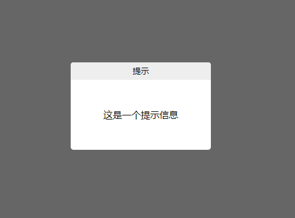

# 全局提示框组件(自动消失)

> 效果

## 引用方式

import toast from 'src/index';   

Vue.prototype.$toast = toast;  

## 全局可调用  

this.$toast(text,duration,callback);  

### 参数说明
text：（必须）提示文字。类型string，可以为html文本，不传时为默认值（这是一个提示信息）；  
duration：（非必须）提示框显示时间。类型 number（毫秒），默认值3000；  
callback：（非必须）提示框消失后回调方法。可执行页面跳转等操作；  
